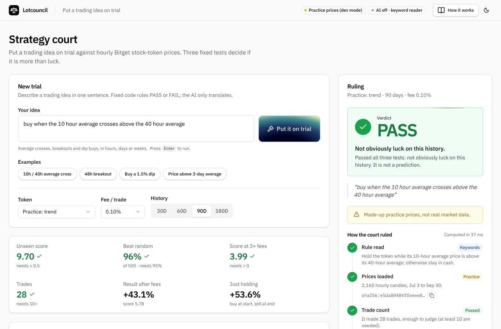
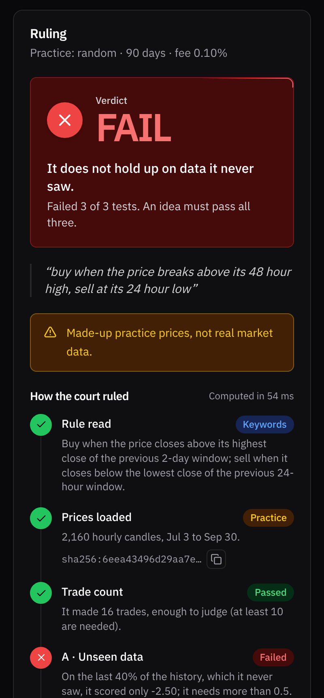

# Lotcouncil

**Before your AI agent trades, put its idea on trial.**

Lotcouncil tells you whether a trading idea is real or just luck, before you risk money on it. Type the idea in plain English. The app tests it on hourly prices of Bitget tokenized US stocks and returns a clear **PASS** or **FAIL** with the evidence.

The AI translates your sentence into a rule and explains the result in plain words. Fixed, deterministic code runs three tests and makes the ruling. **The AI never decides pass or fail.**

<p>
  
  
</p>

The page is a trading-terminal layout: a new-trial command bar, a KPI strip, a candlestick chart with the rule's holding periods, tabs for the three tests, the full trade ledger, a plain-words explanation and an editable rule, and a ruling inspector with a step-by-step court timeline (with measured timings) and export actions. The UI is built from Svelte ports of [VengeanceUI](https://www.vengenceui.com) components (MIT; see [`brand.md`](brand.md) for the list, tokens and contrast checks).

The screenshots were taken in developer practice mode (made-up prices, labelled as such), because the build environment could not reach Bitget. On a normal install the app only shows real Bitget prices. See [Status](#status).

## Quick start

> **New here, or setting it up on your own PC?** Follow [docs/GETTING-STARTED.md](docs/GETTING-STARTED.md): a step-by-step guide for Windows, Mac and Linux. In short: install Git, Python 3.12 and Node.js LTS, clone the repo, then run `python3 run.py` (Windows: `py run.py`). It installs what's missing, builds the page and opens <http://localhost:8000>.

By hand:

The court and API are Python (FastAPI). The page is a SvelteKit app (Svelte 5, TypeScript, Tailwind CSS 4, VengeanceUI components ported to Svelte, Lucide icons) built to static files that the Python server serves.

```bash
pip install -r requirements.txt
(cd frontend && npm ci && npm run build)       # builds frontend/build
uvicorn lotcouncil.server:app --port 8000      # or: python -m lotcouncil serve
# open http://localhost:8000
```

Working on the page? Keep the API running on port 8000 and start the Svelte dev server, which proxies `/api` to it:

```bash
cd frontend && npm run dev                     # http://localhost:5173, hot reload
npm run check                                  # svelte-check: types and accessibility
```

With no API key the app still works: a built-in keyword reader understands ideas and a template writes the explanation. To turn the AI on, copy `.env.example`, set `NEBIUS_API_KEY`, and export it before starting the server.

Command line:

```bash
python -m lotcouncil judge "buy when the 10 hour average crosses above the 40 hour average" --symbol rAAPLUSDT --audit ruling.json
python -m lotcouncil rerun ruling.json      # same data, same rule -> same ruling, or it says what differs
```

## How the court works

An idea passes only if it makes at least **10 trades** and passes **all three tests**. Everything is in [`lotcouncil/court.py`](lotcouncil/court.py), which never calls an AI.

| Test | Plain question | How it works | Passes when |
| --- | --- | --- | --- |
| A. Unseen data | Does it work on data it never saw? | The history is split 60/40 by time. Only the last 40% is judged. | Score on the last 40% is above 0.5 |
| B. Random timing | Is the timing better than chance? | 500 copies hold the same positions in shuffled 24-hour blocks. | The real result beats at least 95% of the copies |
| C. Stress | Does it survive a worse world? | Fees are tripled, and weekend candles are checked on their own. | Score at 3x fees is above 0, and weekend loss is under half the total result |

Details that decide edge cases:

- **Score** is the mean hourly return divided by its standard deviation, scaled to a year (an annualised Sharpe ratio, no risk-free rate). Hours in cash count as zero-return hours.
- **No look-ahead.** A decision made at the close of one candle is held during the next. A test checks this for every rule type by changing future prices and confirming past positions do not move.
- **Fees** are charged each time the position changes: 0.10% by default, or 0.05% / 0.20%.
- **Test B uses returns before fees.** Shuffling blocks adds position changes at block edges, which would unfairly charge the copies more. Fees are judged in test C.
- **Weekend** means candles that open between Friday 20:00 and Sunday 20:00 New York time, when the native 24/5 US session is shut and Bitget's prices come from a market maker. Daylight saving is handled. US holidays are not treated specially.
- **Weekend rule:** a weekend gain always passes. A weekend loss passes only when the whole run is profitable and the loss is under half of it.
- **Determinism:** the shuffles use a fixed seed (recorded in every audit file). The calibration run repeats rulings and checks they match exactly.
- **Rules are long-only:** hold the token or sit in cash. No short selling, no volume (Bitget volume may be empty before July 9, 2026).

### The three idea types

| Type | Example sentence | Rule |
| --- | --- | --- |
| Average cross | "buy when the 10 hour average crosses above the 40 hour average" | `{"type": "ma_cross", "fast": 10, "slow": 40}`: hold while the fast average is above the slow one. `fast: 1` means the price itself. |
| Breakout | "buy when the price breaks above its 48 hour high, sell at its 24 hour low" | `{"type": "breakout", "lookback": 48, "exit_lookback": 24}` |
| Dip buy | "buy when the price drops 1.5% below its 24 hour average, sell after 24 hours" | `{"type": "dip_buy", "drop_pct": 1.5, "lookback": 24, "max_hold": 24}`: sell back at the average or after `max_hold` hours |

Lengths are in hours; days and weeks are converted. Anything else (RSI, MACD, volume, shorting, minutes) is refused with a message that lists what the court can read.

## The AI layer

The AI has two jobs and no authority ([`lotcouncil/ai.py`](lotcouncil/ai.py)).

- **Understand the idea.** One sentence in, one small JSON rule out. The rule must pass the same strict validator the court uses (known type, known fields, sane ranges), or it is thrown away and the keyword reader takes over.
- **Explain the ruling.** The model sees only display-ready numbers from the court, never prices or chart data. Its four sentences are shown only if they pass checks: every number in the text must match a number the court produced, the verdict word must match, and wording that doubts the verdict or gives advice is rejected. Otherwise the template explanation is shown with a notice. The verdict is streamed to the page before the explanation is even requested.
- **Model:** Nebius AI Studio through its OpenAI-compatible API, default `Qwen/Qwen3-235B-A22B-Instruct-2507`, set by `COURT_MODEL`. Check the exact name against Nebius's current model list before launch: it has not been tested with a live key.
- **Keys and cost:** the key stays on the server. Each ruling makes at most two short calls. Each visitor gets `COURT_AI_LIMIT` AI calls per 10 minutes (default 20); after that the fallback is used and the page keeps working.

## Data

Prices come from Bitget's public spot candles: `/api/v2/spot/market/candles` (the newest 1,000) and `/api/v2/spot/market/history-candles` (paged backwards, 200 at a time) for up to 180 days. No key is needed. Only finished candles are used, so a ruling cannot change because the current hour is still moving.

When Bitget cannot be reached, the app falls back to saved candle files in `data/snapshots/` and says so on the ruling. Make them from a machine that can reach Bitget:

```bash
python scripts/fetch_candles.py              # default tokens; prints how many days of history each has
python scripts/fetch_candles.py --list       # which stock-token symbols Bitget lists
```

The app never shows made-up prices to users. If Bitget can't be reached and there is no saved file, it says so and offers to retry.

**Practice markets** (`PRACTICE-TREND`, `PRACTICE-RANDOM`) are made-up, fixed series for offline development: one has a planted trend, one is pure noise. They are **off by default**; set `COURT_PRACTICE=on` to show them (labelled "dev mode"). The tests and `scripts/calibrate.py` use them.

## Sharing and audit files

- **Copy verdict card:** a 1200x630 image of the ruling (copied to the clipboard, shared on phones, or downloaded).
- **Copy link:** a URL with the token, window, fee, rule and the time of the last candle, so opening it re-runs the same ruling on the same candles.
- **Download audit file:** JSON with the idea, the rule, the exact candles, their SHA-256 fingerprint, the fee, the thresholds, the seed and the result. Re-run it under *How this works* on the page, or with `python -m lotcouncil rerun file.json`. A re-run uses the thresholds stored in the file, and reports if today's defaults differ.

## For AI agents (MCP)

`judge_strategy` lets an agent put its own idea on trial before it trades. The agent gets the verdict as data and cannot change how it is made.

```bash
python -m lotcouncil mcp      # MCP server over stdio
```

Example client config (most MCP clients use this shape):

```json
{
  "mcpServers": {
    "lotcouncil": {
      "command": "python",
      "args": ["-m", "lotcouncil", "mcp"],
      "cwd": "/path/to/Lotcouncil",
      "env": { "NEBIUS_API_KEY": "" }
    }
  }
}
```

Tools: `judge_strategy(idea | rule, symbol="rAAPLUSDT", days=90, fee_pct=0.1)` returns `verdict`, `headline`, `reasons`, per-test results, the data fingerprint and the explanation. `list_markets()` lists tokens, windows and fees.

## HTTP API

| Method | Path | Body / query | Returns |
| --- | --- | --- | --- |
| GET | `/api/markets` | | tokens, windows, fees, whether the AI is on |
| GET | `/api/prices` | `symbol`, `days` | hourly closes and data source |
| POST | `/api/understand` | `{idea}` | `{rule, rule_text, source, notice}` |
| POST | `/api/judge` | `{symbol, days, fee_pct, idea}` or `{..., rule}`, optional `end` (seconds) | NDJSON stream: `understood`, `data`, `gate`, `A`, `B`, `C`, `verdict`, `explanation`, or one `error` |
| POST | `/api/audit` | `{symbol, days, end, rule, fee_pct, idea}` | audit file (JSON) |
| POST | `/api/rerun` | an audit file | `{same, hash_ok, verdict_in_file, verdict_now, differences}` |

Interactive docs are at `/api/docs`.

## Configuration

| Variable | Default | Meaning |
| --- | --- | --- |
| `NEBIUS_API_KEY` | empty (AI off) | Nebius AI Studio key |
| `NEBIUS_BASE_URL` | `https://api.studio.nebius.com/v1` | OpenAI-compatible endpoint |
| `COURT_MODEL` | `Qwen/Qwen3-235B-A22B-Instruct-2507` | model name |
| `COURT_AI` | `on` | `off` forces the fallback even with a key |
| `COURT_TOKENS` | 8 large US stocks | comma-separated Bitget symbols for the picker |
| `COURT_RATE_LIMIT` / `COURT_AI_LIMIT` | 60 / 20 | per visitor, per `COURT_RATE_WINDOW_SECONDS` (600) |
| `COURT_TRUST_PROXY` | `on` | read the visitor address from `X-Forwarded-For` |
| `BITGET_BASE_URL`, `COURT_SNAPSHOT_DIR` | Bitget, `data/snapshots` | data sources |
| `COURT_PRACTICE` | `off` | `on` adds the made-up practice markets (offline development only) |

## Deploy

Any host that runs a Docker image or a Python web process works. Put `NEBIUS_API_KEY` in the host's secrets.

- **Docker** (Hugging Face Spaces, Fly.io, Railway, Render): the `Dockerfile` builds the Svelte app in a Node stage, then runs the Python server. Set `PORT` if the host needs it.
- **Without Docker** (Render, Railway with the `Procfile`): build command `pip install -r requirements.txt && cd frontend && npm ci && npm run build`, start command from the `Procfile`.

Before announcing the link, check from the host that Bitget answers: `python scripts/fetch_candles.py rAAPLUSDT`. If the host is blocked, commit snapshots made elsewhere and the app will use them.

The PRD planned Streamlit Community Cloud. This build uses a SvelteKit page on a FastAPI server instead, because the design requirements (a ruling that fits the first screen on a 400px phone, live per-test progress, a copyable verdict card, an editable rule) are hard to meet in Streamlit, and Streamlit Cloud cannot host this stack.

## Tests and calibration

```bash
pip install -r requirements-dev.txt
pytest -q                                     # 131 tests: court, data, AI checks, API, audit, MCP
(cd frontend && npm run check)                # svelte-check: 0 errors, 0 warnings
python scripts/calibrate.py --real --out docs/calibration.md
```

From [`docs/calibration.md`](docs/calibration.md) (100 made-up series per market type, 90 days, 4 rules):

- **Fake-edge rejection:** random prices failed **97.9%** of 800 rulings (target 95%+). Per rule type it ranges from 93% to 100%. The dip-buy rule is the weakest (93–94%), so test B's threshold is the lever if real data calls for a stricter court.
- **Real-edge acceptance:** on planted-trend prices the 10/40 average cross passed 29% and the 48h breakout 34% (each series is short, so even a real edge often cannot prove itself); the dip buy, which bets against trends, passed 0%.
- **Same input, same ruling:** every repeated ruling matched exactly.
- **Time to ruling:** median about 40 ms for 2,160 candles (target under 10 s).

Test B alone was checked separately on 300 random series: it passes 5–6% of them, as a 95% threshold should.

## Status

What is done and checked here:

| ID | Requirement | Status |
| --- | --- | --- |
| R1 | Hourly candles for Bitget stock tokens | Built, with paging, finished-candle filter, snapshot fallback. **Not tested against live Bitget**: the build environment's network blocks `api.bitget.com`. |
| R2 | Plain English to rule | Built: AI path plus keyword reader; three types parse (tested). |
| R3 | Three tests, PASS or FAIL | Built; same input gives the same ruling (tested). |
| R4 | Ruling, tests and chart | Built in Svelte: verdict inspector with court timeline, KPI strip, candlestick chart with holding periods, one visual per test, trade ledger, loading skeletons. |
| R5 | AI explanation from court numbers | Built with a number check. **Not tested with a live Nebius key.** |
| R6 | Bad input never crashes | Built: every error becomes one plain message (tested). |
| R7 | Public link on a phone | Ready to deploy (Docker / Procfile). No public link yet. Checked at 375, 400, 768 and 1280px in light and dark, no sideways scroll. |
| R8 | Shareable verdict card | Built (image and link). |
| R9 | Audit file anyone can re-run | Built (web and CLI); tampering is detected (tested). |
| R10 | MCP `judge_strategy` | Built and checked over stdio. |
| R11, R12 | Compare two ideas, paper-trading follow-up | Not started (Later). |

Next steps, in the PRD's build order: run `scripts/fetch_candles.py` from the real host and record history depth per token, re-run `scripts/calibrate.py --real` and tune thresholds on real candles, test the live Nebius connection with the fallback on and off, deploy, test on a real phone, then record the demo.

## Project layout

```
lotcouncil/            Python: the court and its API
  court.py             the three tests and the verdict (no AI)
  rules.py             rule types, validation, positions
  data.py              Bitget candles, snapshots, practice markets, data hash
  parse.py             keyword reader (AI fallback)
  ai.py                Nebius client, idea reading, explanation checks
  audit.py             audit files and re-runs
  service.py           one path from idea to ruling for web, CLI and MCP
  server.py            FastAPI app; serves frontend/build
  mcp_server.py        judge_strategy for agents
  synthetic.py         made-up price series
frontend/              SvelteKit app (Svelte 5 runes, TypeScript, Tailwind 4)
  src/routes/          the page, layout and design tokens (layout.css)
  src/lib/             API client, run state, rules, formatting, verdict card
  src/lib/components/  verdict, test cards, charts, rule editor, drawer
    ui/                Svelte ports of VengeanceUI components (MIT notice inside)
scripts/               fetch_candles.py, calibrate.py
tests/                 pytest suite
```

## Not financial advice

A PASS means "not obviously luck on this history". It does not mean the idea will make money next month. Lotcouncil never places trades or holds money.
